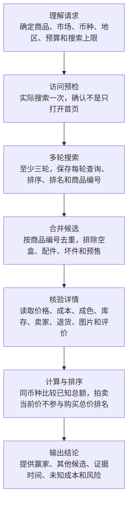

# eBay 商品查价与风险研究

## 这个仓库是什么

这是 `$ebay-price-research` 的独立 Git 仓库

它帮助 Agent 在 eBay 上多轮搜索当前在售商品，读取商品详情，再比较价格、运费、税费、卖家、成色、退货、图片、评价和风险

它不会下单、出价、议价、联系卖家、关注商品或保存登录信息

## 用户怎样使用

```text
使用 $ebay-price-research 搜索 ebay.com 上 500 USD 以内可以寄到 California 的 VITURE Beast
只看固定价或支持 Best Offer 的商品
```

## 完整工作流



| 节点 | 作用 |
| --- | --- |
| `plan-research` | 把自然语言整理成明确商品与有限搜索计划 |
| `preflight-access` | 证明当前后端能真正进入搜索结果 |
| `collect-search-rounds` | 保存至少三轮实际看到的商品卡片 |
| `merge-and-shortlist` | 按数字商品编号去重并排除明显错配 |
| `inspect-details` | 核验价格、币种、成本和风险事实 |
| `rank-offers` | 机械计算可比金额并选择最低可行候选 |

## 为什么需要访问预检

能打开 eBay 首页不能证明可以搜索

预检必须实际执行目标查询，并看到结果列表或明确的无结果页面

登录、验证码或人机验证会暂停，宿主策略阻止会停止，并且不能换工具绕过

## 最低价怎样计算

```text
商品价 + 运费 + 进口费用 + 税费 - 已核验优惠
```

未知费用不会被猜成零

不同币种没有实时汇率证据时不会直接混排

拍卖当前价不是最终成交价，因此只作证据展示

## 最重要的文件

| 文件 | 用途 |
| --- | --- |
| `.agents/skills/ebay-price-research/SKILL.md` | 触发范围和运行规则 |
| `.agents/skills/ebay-price-research/workflow.yaml` | 节点顺序、执行器、失败和停止规则 |
| `.agents/skills/ebay-price-research/schemas/` | 每一步允许返回的 JSON |
| `.agents/skills/ebay-price-research/scripts/` | Runner、去重、成本、排名和 validator |
| `.agents/skills/ebay-price-research/references/` | 多轮采集、风险和后端审计 |
| `tests/` | 成功、失败、空结果、拍卖和跨币种测试 |
| `SECURITY.md` | 凭据、登录和外部写入边界 |

## 入口 JSON

```json
{
  "request_text": "搜索 eBay 上最便宜可行的 VITURE Beast",
  "marketplace": "ebay.com",
  "destination_country": "United States",
  "destination_region": "California",
  "comparison_currency": "USD",
  "maximum_budget": "500",
  "desired_condition": "any",
  "buying_formats": ["fixed-price", "best-offer"],
  "detail_limit": 12
}
```

地区只使用州、省或城市级信息，不写精确地址和邮政编码

## 安装与验证

```bash
python3 scripts/install_local.py
python3 scripts/validate.py
python3 -m unittest discover -s tests -v
python3 scripts/check_secrets.py
python3 .agents/skills/ebay-price-research/scripts/freeze_core.py --check
```

仓库只保存代码、文档和脱敏测试数据

密码、API token、Cookie、浏览器配置、验证码、地址和未脱敏运行产物禁止提交
